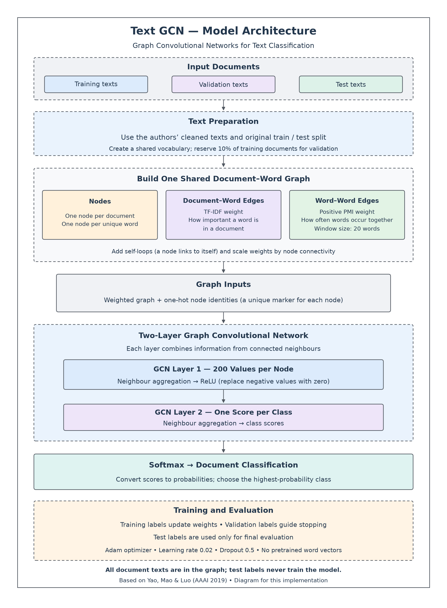
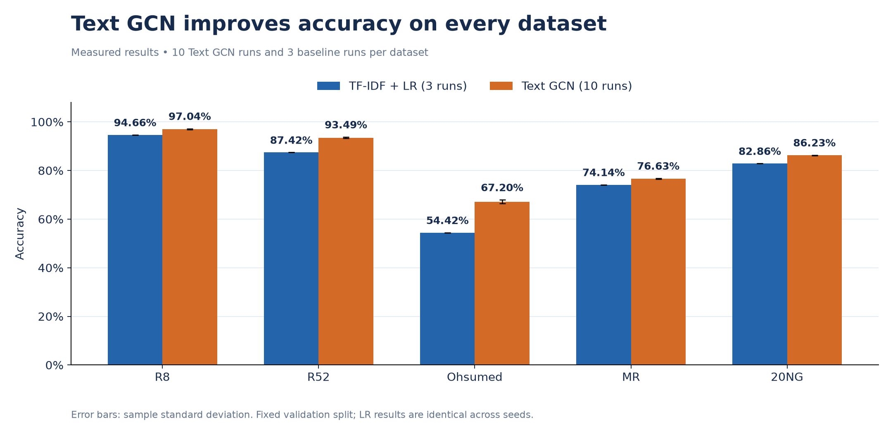
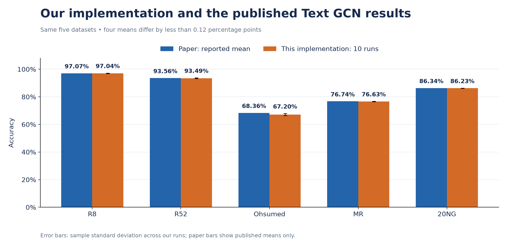
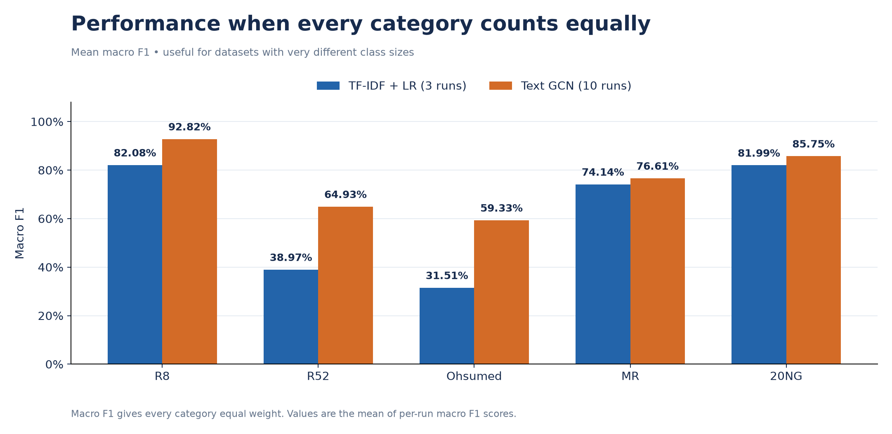
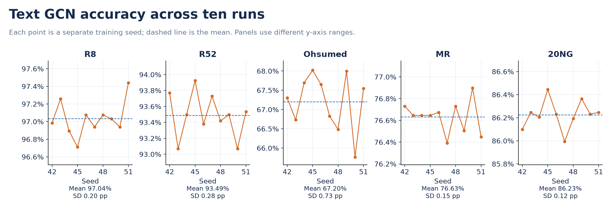
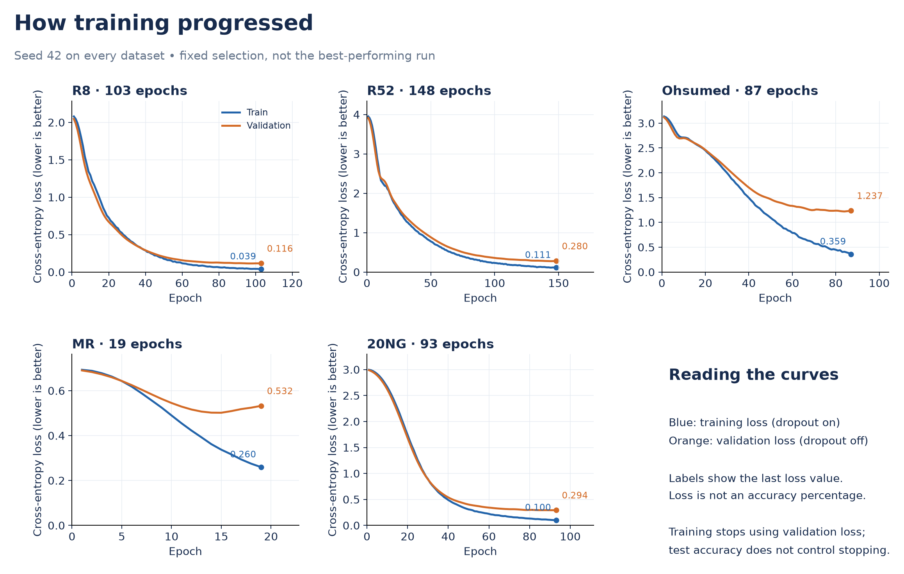

# TextGCN Implementation

A PyTorch implementation of **Graph Convolutional Networks for Text Classification** by Liang Yao, Chengsheng Mao and Yuan Luo (AAAI 2019).

**5 datasets · 2 models ·**

[Overview](#paper-overview) · [Architecture](#model-architecture) · [Results](#results) · [Run](#run-the-code)

## Paper overview

**Text classification** means assigning a category to a document, such as a news topic or positive/negative sentiment.
The paper studies how relationships across a whole collection of documents can help classify individual documents.
Its main idea is to represent documents and words together in a graph, then learn from their connections.

For example, “team wins match” and “team scores goal” share the word **team**.
Connecting both documents to that word lets the model use their relationship when learning sports-related patterns.
This is an illustration; actual connections depend on statistics across the dataset.

The paper's contribution is the shared document–word graph approach to classification.
GCN layers, TF-IDF and PMI are existing methods combined in this approach.

## Model architecture



**Flow:** Documents → shared graph → node features → GCN layer 1 → GCN layer 2 → class probabilities.

### 1. Documents and graph nodes

A **graph** is a collection of objects called nodes, joined by connections called edges.
Each dataset gets its **own graph** containing training, validation and test texts; the five datasets are not combined.
Every document is one node, and every unique word is one shared word node.
For **D documents** and **V unique words**, the graph has **N = D + V nodes**.

### 2. Weighted connections

An **edge weight** describes the strength of a connection. Connections work in both directions.

| Connection | Weight and purpose |
|---|---|
| Document ↔ word | **TF-IDF:** connects a document to words it contains, weighted by their importance |
| Word ↔ word | **Positive PMI:** connects words that occur together more often than expected |
| Node ↔ itself | Weight 1 before scaling; retains the node's own information |
| Document ↔ document | No direct edge; information can pass through shared word nodes |

**TF-IDF** combines a word's count in a document with how uncommon it is across documents.
The graph uses `word count × log(total documents / documents containing the word)`.
**PMI**, pointwise mutual information, measures association between words using **20-word windows**.
Only positive PMI edges are retained; windows never cross document boundaries.

### 3. Graph inputs

An **adjacency matrix** stores the edge weights. **Normalization** scales them by each endpoint's total connection weight.
The code stores only existing connections in a **sparse matrix**, avoiding a large table of zeros.
Each node starts with a **one-hot identity feature**—a unique marker, not a pretrained word meaning.
The identity matrix is handled implicitly, so the code never allocates the full `N × N` feature matrix.

### 4. First GCN layer: learn node representations

**Graph convolution** combines information from neighbouring nodes using edge weights and learned parameters.
Layer 1 learns **200 values per node**, called an **embedding** or learned representation.
**ReLU** replaces negative values with zero after this layer, enabling a nonlinear model.
**Dropout** randomly removes contributions during training to reduce dependence on particular features; its rate is **0.5**.
Dropout is applied to identity-feature contributions and the first layer's output, and is disabled during evaluation.

### 5. Second GCN layer: produce category scores

Layer 2 combines neighbour information again and converts the 200 values into **C class scores**, where C is the number of categories.
Two layers allow information to travel up to two connections, such as `document A → shared word → document B`.
The network processes word and document nodes, but the classification task evaluates document nodes.

### 6. Softmax: make a prediction

**Softmax** converts class scores into probabilities adding up to 1; the highest-probability category is selected.
For example, Sport = 0.80 and Science = 0.20 would predict Sport. These are illustrative probabilities.

| Stage | Output shape | Meaning |
|---|---|---|
| Graph | N × N, sparse | Scaled connection weights |
| First GCN layer | N × 200 | Learned representation of every node |
| Second GCN layer / softmax | N × C | Category scores / probabilities |

For R8, **N = 7,674 + 7,688 = 15,362** and **C = 8**.
Its layer outputs are `15,362 × 200` and `15,362 × 8`. No GloVe or Word2Vec embeddings are used.

## Training and evaluation

**Loss** measures prediction error; **cross-entropy loss** penalizes low probability for the correct category.
Each **epoch** is one full-graph training iteration: predict scores, calculate loss on training documents, update weights and check validation loss.
**Adam** is the optimizer that updates the learned parameters. Graph connections remain fixed during training.

| Document group | Text included in graph? | Purpose of its labels |
|---|---|---|
| Training | Yes | Calculate loss and update weights |
| Validation | Yes | Monitor progress and decide when to stop |
| Test | Yes | Measure final performance only |

This is **transductive learning**: test texts are present in the graph, but **test labels never train the model**.
A completely new document arriving later needs an additional graph/model procedure beyond this evaluated setup.

| Setting | Value |
|---|---|
| GCN layers / hidden size | 2 / 200 |
| Word window / dropout | 20 / 0.5 |
| Optimizer / learning rate / L2 penalty | Adam / 0.02 / 0 |
| Maximum epochs | 200 |
| Validation split | Fixed 10% of original training set; seed 1234 |
| Early stopping | After an initial wait, stop when current validation loss exceeds the previous ten losses' mean |
| Evaluated checkpoint | Final `last.pt`, not `best_validation.pt` |

## Baseline and datasets

A **baseline** is a simpler comparison model. Here, TF-IDF word features feed a **Logistic Regression** classifier, which learns weighted category scores.
Unlike Text GCN, it has no document–word graph. Its normalized, smoothed TF-IDF is fitted on labelled training texts only.
Logistic Regression uses `C=1`, solver `lbfgs` and at most 3,000 iterations. Neither model uses pretrained word vectors.

| Dataset | Task | Documents | Original train | Test | Classes |
|---|---|---:|---:|---:|---:|
| R8 | Reuters topics | 7,674 | 5,485 | 2,189 | 8 |
| R52 | Reuters topics | 9,100 | 6,532 | 2,568 | 52 |
| Ohsumed | Medical categories | 7,400 | 3,357 | 4,043 | 23 |
| MR | Movie-review sentiment | 10,662 | 7,108 | 3,554 | 2 |
| 20NG | Newsgroup topics | 18,846 | 11,314 | 7,532 | 20 |

## Results

A **seed** controls random training choices. Text GCN uses seeds **42–51** (50 runs); the baseline uses **42–44** (15 fits).
All seeds share the same validation split. Values below are mean test accuracy ± **sample standard deviation**, describing variation between runs.
**pp** means percentage points. Paper values are published references, not extra runs performed here.

| Dataset | TF-IDF + LR, 3 runs | Text GCN, 10 runs | Paper Text GCN | Difference |
|---|---:|---:|---:|---:|
| R8 | 94.66 ± 0.00% | **97.04 ± 0.20%** | 97.07% | −0.03 pp |
| R52 | 87.42 ± 0.00% | **93.49 ± 0.28%** | 93.56% | −0.07 pp |
| Ohsumed | 54.42 ± 0.00% | **67.20 ± 0.73%** | 68.36% | −1.16 pp |
| MR | 74.14 ± 0.00% | **76.63 ± 0.15%** | 76.74% | −0.11 pp |
| 20NG | 82.86 ± 0.00% | **86.23 ± 0.12%** | 86.34% | −0.11 pp |



Text GCN exceeds this baseline on all five datasets; its largest gain is **12.79 pp on Ohsumed**.
Four means are within **0.12 pp** of the paper. Ohsumed is **1.16 pp** lower; these experiments do not isolate the cause.



**Macro F1** balances finding a category's documents and predicting that category correctly, then averages equally across categories.
R52's **93.49% accuracy** versus **64.93% macro F1** shows that high overall accuracy can hide weaker category-level performance.



The seed plot shows training variability, not uncertainty over different splits. Identical baseline fits explain its zero spread.



The loss curves use **seed 42** for every dataset. Loss is not a percentage; training uses dropout while validation does not.



## Implementation notes and limits

- The code follows released-code PMI counting and stopping: repeated token pairs within a window count multiple times.
- R52 uses one deterministic validation-split swap to retain a training example for a rare class; test membership is unchanged.
- This is a PyTorch implementation; the authors used TensorFlow. Other paper models and parameter sweeps are outside scope.
- The results came from the earlier multi-file version; the full 65-run experiment has not been rerun after consolidation.
- Saved outputs from all 65 runs were audited; checkpoint inference was not rerun. Four synthetic checks passed after consolidation, including exact CPU resume.
- Results use CPU and one fixed split. No statistical-equivalence claim is made; cloud/GPU execution was not validated for these results.

## Run the code

Use Python **3.10+** from this folder. No GPU is required. Create an environment and try one R8 Text GCN run:

```powershell
python -m venv .venv
.\.venv\Scripts\Activate.ps1
python -m pip install -r requirements.txt
python textgcn.py prepare --root artifacts
python textgcn.py train --root artifacts --datasets R8 --models textgcn --seeds 42 --device cpu
```

For the complete **65-run plan**, use these commands (`config.json` alone defaults to 30 runs):

```powershell
python textgcn.py train --models tfidf_lr --seeds 42 43 44 --device cpu
python textgcn.py train --models textgcn --seeds 42 43 44 45 46 47 48 49 50 51 --device cpu
python textgcn.py results
python textgcn.py audit
```

Press **Ctrl+C** to stop, then repeat the same command to resume Text GCN from its last saved epoch. Completed runs are skipped.
Keep code, settings, data and device unchanged. Earlier multi-file checkpoints require their original code; this folder starts new runs.

## Repository guide

| File / folder | Purpose |
|---|---|
| `textgcn.py` | Complete implementation; `build()` constructs the graph, `make_gcn()` defines both layers, `train_gcn()` trains them |
| `config.json` / `requirements.txt` | Experiment settings / Python dependencies |
| `assets/` | Six figures displayed in this README |
| `results/` | Summary and per-run CSVs, dataset statistics and experiment provenance |
| `artifacts/` | Created locally for datasets, checkpoints and new reports; excluded from Git |

Results and figures can be viewed without training. README figures are static; new reports do not automatically replace them.
Summary accuracy uses percentages; per-run accuracy and F1 fields use fractions. Existing checkpoints are kept in the original working folder.

## Architecture explanation for a presentation

> “The model represents documents and words as nodes in one graph per dataset. TF-IDF connects documents to words, and positive PMI connects related words. The first GCN layer learns 200 values per node; the second produces category scores. Softmax turns them into probabilities. Only training labels update the model; validation controls stopping and test labels measure final performance.”

## References

**Yao, L., Mao, C., & Luo, Y. (2019).** *Graph Convolutional Networks for Text Classification.* AAAI, 33, 7370–7377. [Authors' source and data](https://github.com/yao8839836/text_gcn).
GCN layers build on **Kipf & Welling (ICLR 2017)**, *Semi-Supervised Classification with Graph Convolutional Networks*.
